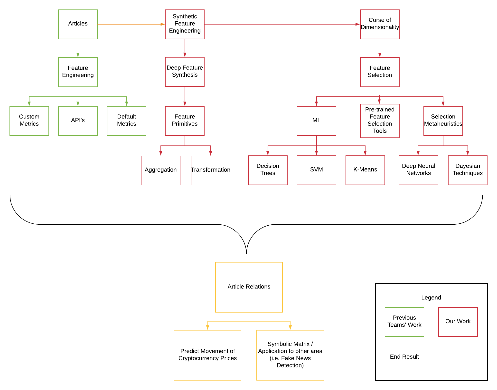
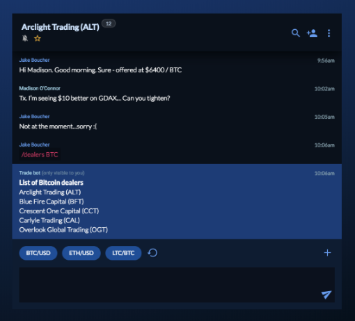
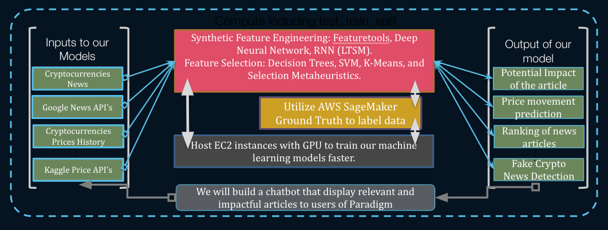

# Deep Synthetic Feature Engineering for Cryptocurrency News

## Introduction
We are exploring different Machine Learning techniques and models to extract deep synthetic features from news article about cryptocurrencies to predict the impact of news article on price movement and also the empirical rankings of news article base on potential impact to reduce the time and effort it takes for traders and the public to find news that are important.

## Team
**Eric Liu**: 4th year EECS major at UC Berkeley

**Jun Zhang**: 4th year Applied Math major at UC Berkeley

**Rick Yang**: 4th year Statistics major at UC Berkeley

**Joan Zhu**: 4th year CS and Econs double major at UC Berkeley

**Shun Lin**: 4th year EECS major at UC Berkeley

## About Paradigm
Paradigm provides a conversational marketplace for the crypto trading market. It features AI driven tools like automated over-the-counter trading and  provides a sophisticated chat tool for institutional traders. 

The chat is a combination of several trader tools including counter party discovery,  text-to-trade recognition, etc.

[Website](https://www.paradigm.co/)

[LinkedIn](https://www.linkedin.com/company/paradigmco/)

## About Data-X
Data-X is a framework designed at UC Berkeley for learning and applying AI, data science, and emerging technologies. Data-X fills a gap between theory and practice to empower the rapid development of data and AI projects that actually work.  Data-X projects create new ventures, new research, and corporate innovations all over the world.

[Blog](https://data-x.blog/)

## Problem Statement

**Goal:** predict the impact of news articles on the price of cryptocurrency

**Feature Extraction:** Identify news article features that carry the most influence on prices

**Dashboard with Top Articles:** Recommend articles that are predicted to have strong price impacts to Paradigm users

**News Analytics:** Detect and filter our fake or misleading cryptocurrency news

## Project Overview

Apply ML techniques to **extract/synthesize** features from News Articles, with the final objective of predicting the features’ impacts on cryptocurrency prices. 

Given this information, we can **recommend articles** to Paradigm users that are predicted to have the most influence. 

In the future, we can also **analyze news** in order to detect fake or misleading articles related to cryptocurrency.

Figure 1: Project Overview

## User Perspectives

The end goal of this project is to present a list of ranked recommended articles that our machine learning model predicts to have high impact on cryptocurrency in the near future. 

Figure 2: Potential UI for recommendation

In order to create the best user experience for what they need their purposes for, we will prioritize **accuracy of prediction**. This is to generate the best possible model.
It is also important to implement **ease of use** in order to make users feel like the interface is easily graspable.
Finally, because machine learning models can be very computationally intensive, we will optimize on **computation time** to create a more efficient model with available cloud platforms. 

## Technological Components

1. Ability to input financial news reports

	* Parse text articles
	* Construct features for feature engineering
 
2. Output probabilistic prediction of cryptocurrency increases or decreases

	* Run machine learning algorithms

3. User interface 

	* Graphical interface for inputting news reports

	* Graphical loading interface

	* Graphical interface for outputting cryptocurrency predictions

## Architecture

Figure 3: Architecture of our model

## Future Enhancement

* Continue refining and iterating over 
* better machine learning algorithms
* Ability to tag people in group chat
* Search for phrases within chat
* Screen minimizing and hiding functionality
* Profile picture ability

## References

### Past Paradigm Teams

#### Fall 2018 Team 1
[Poster](https://data-x.blog/projects/paradigm-team-1/)
#### Fall 2018 Team 2
[Github Repository](https://github.com/sudarshanGopal98/data-x-paradigm)

[Poster](https://data-x.blog/projects/paradigm-team-2/)

#### Spring 2017 Team 
[Blog](https://data-x.blog/projects/riskex/)

